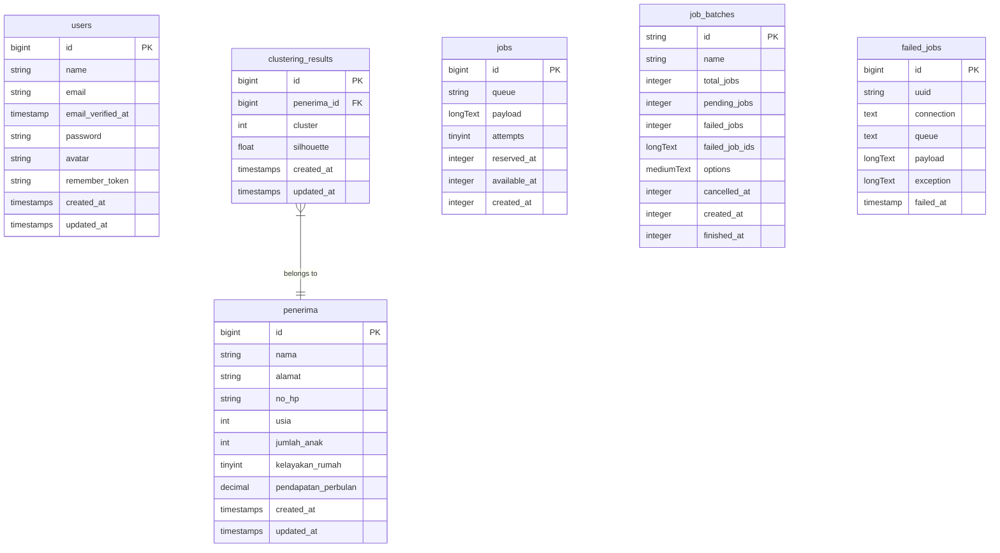

# Database Schema

This document outlines the database schema of the KMeans clustering system.

## Entity-Relationship Diagram

## Table Descriptions

### users
Standard user authentication table with basic profile information.

### penerima
Contains data about recipients with socioeconomic attributes used for clustering.

### clustering_results
Stores the results of K-means clustering algorithm applied to penerima data.

### Other Tables
The database also includes Laravel's standard tables for job processing.
